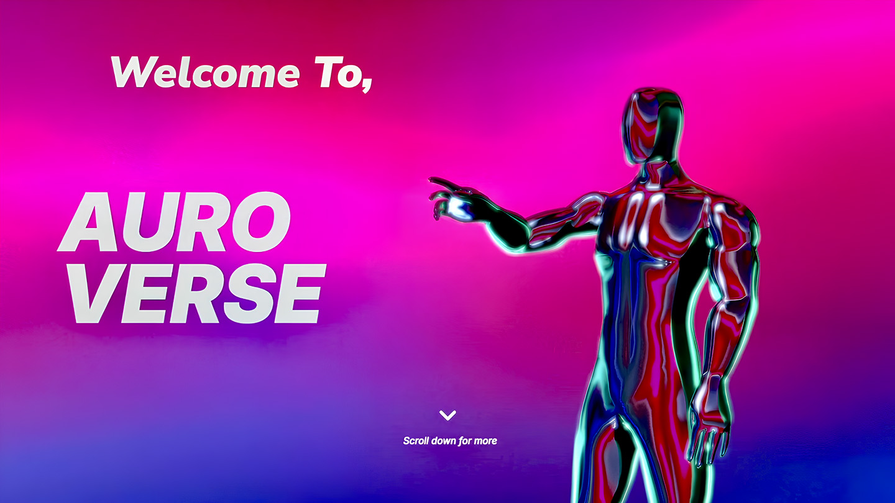

Tech Fest 2023 - AuroVerse
==========================
## Description
This is the official repository for the AuroVerse Tech Fest 2023. This repository contains the source code for the website, the documentation, and the source code for the AuroVerse Web App.

visit the website at [https://auroverse.netlify.app](https://auroverse.netlify.app)

##preview of the website in image and video format


demo video link: 


## Start Developing
1. Clone the repository
2. Install dependencies
```bash
yarn
```
3. Start the development server
```bash
yarn dev
```
4. Open [http://127.0.0.1:5173](http://127.0.0.1:5173) with your browser to see the result.

## Table of Contents
- [Description](#description)
- [Table of Contents](#table-of-contents)
- [Contributing Guide](#contributing-guide)
  - [Getting Started](#getting-started)
  - [Frameworks/Libraries Used](#frameworkslibraries-used)

### Contributing Guide
#### Getting Started
1. Fork this repository
2. Clone the forked repository to your local machine
3. Create a new branch
4. Make your changes
5. Commit and push your changes
6. Create a pull request

##### Frameworks/Libraries Used
- [React](https://reactjs.org/)
- [Vite](https://vitejs.dev/)
- [React-Three-Fiber]()
- [Three.js ](https://threejs.org/)
- [Gsap](https://greensock.com/gsap/)
- [Framer Motion](https://www.framer.com/motion/)


